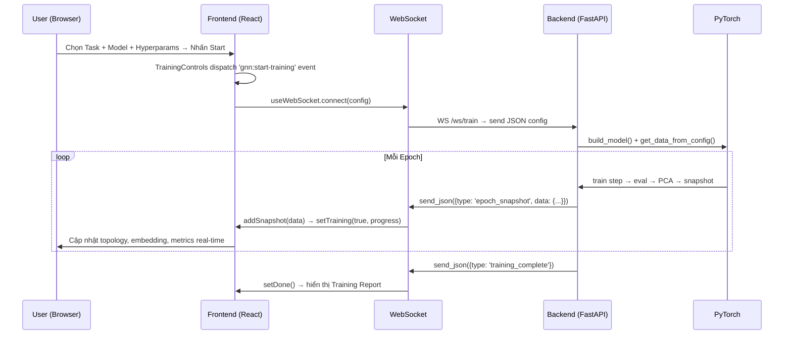

# 🧠 GNN-INSIGHT — Tổng Quan Dự Án (Master Reference)

> **Architecture note**: `docs/technical/ARCHITECTURE.md` is the current
> source of truth for storage ownership, retention, replay, compare-runs, and
> governance flows. Use this overview for orientation, but defer to
> `ARCHITECTURE.md` when details conflict.
> **API note**: `docs/technical/API_CONTRACT.md` is the current source of truth
> for page-facing REST payload shapes, especially list endpoints used by the
> app shell and admin shell.
> **Frontend note**: `docs/technical/FRONTEND_STRUCTURE.md` explains the
> route-first frontend structure and current shell boundaries.
> **Testing note**: `docs/technical/TESTING_STRATEGY.md` defines the current
> TDD and verification gates.
> **Deployment note**: `docs/technical/DEPLOYMENT.md` captures the local stack,
> env vars, and MinIO-ready blob settings.

> **Frontend shell note**: The product flow is now `auth-first` with real page
> routes. Use `/login` and `/register` for public access, `/app/*` for the
> researcher or viewer shell, and `/admin/*` for the admin shell. Do not treat
> the old overlay-style app entry as the intended product UX.
> `Dashboard`, `Projects`, `Datasets`, and the admin surfaces are now being
> extracted into page-first routes so the Lab can stay focused on training and
> replay instead of acting as a multi-purpose navigation shell.

> **Mục đích file này**: Khi AI bắt đầu phiên mới, đọc file này để hiểu ngay dự án đang làm gì, kiến trúc ra sao, các file nằm ở đâu, và trạng thái hiện tại.

---

## 1. Dự Án Đang Làm Gì?

**GNN-Insight** là một nền tảng web **trực quan hóa và giải thích (Explainable AI)** cho **Graph Neural Networks (GNNs)**. Hệ thống cho phép người dùng:

1. **Chọn tác vụ GNN** (6 tác vụ khác nhau)
2. **Cấu hình mô hình** (GCN, GAT, GraphSAGE) và siêu tham số
3. **Huấn luyện real-time** qua WebSocket, stream kết quả từng epoch
4. **Trực quan hóa quá trình học** — thấy mô hình học như thế nào, không chỉ kết quả cuối
5. **Tải dữ liệu tùy chỉnh** (CSV/JSON/PT) hoặc dùng dataset có sẵn (Cora, CiteSeer)
6. **Phát lại (playback)** quá trình huấn luyện như xem video
7. **Lưu trữ và quản lý thí nghiệm** trong thư viện (Library)

### Ngôn ngữ giao diện: Tiếng Việt 🇻🇳

---

## 2. 6 Tác Vụ GNN (Tasks)

| Task | Tên | Mô tả | File Backend | File Frontend |
|------|-----|--------|-------------|---------------|
| **1** | Node Classification | Phân loại nút (Cora/CiteSeer). GCN/GAT/SAGE → softmax | `tasks/node_classification.py` | `TopologyView.jsx`, `NodeInfoPanelV2.jsx` |
| **2** | Graph Classification | Phân loại đồ thị (50 đồ thị ER vs Scale-free). Attention-based readout | `tasks/graph_classification.py` | `TaskTopology2.jsx`, `ReadoutMonitor.jsx` |
| **3** | Link Prediction | Dự đoán cạnh thiếu. GCN Encoder + Dot-product Decoder. AUC/ROC | `tasks/link_prediction.py` | `TaskTopology3.jsx`, `ROCMonitor.jsx`, `PairProximityView.jsx` |
| **4** | Community Detection | Phát hiện cộng đồng (unsupervised). KMeans trên GNN embedding. Modularity Q | `tasks/community_detection.py` | `TaskTopology4.jsx`, `ModularityMonitor.jsx`, `DendrogramView.jsx` |
| **5** | Graph Embedding | Embedding unsupervised (link reconstruction). PCA/t-SNE, kNN preservation | `tasks/graph_embedding.py` | `TaskTopology5.jsx`, `EmbeddingSpaceB.jsx`, `StructurePreservation.jsx` |
| **6** | Graph Generation | Sinh đồ thị mới. Validity/Uniqueness/Novelty. Latent space | `tasks/graph_generation.py` | `TaskTopology6.jsx`, `LatentSpaceView.jsx`, `ValidityMonitor.jsx` |

---

## 3. Kiến Trúc Hệ Thống

```
┌─────────────────────────────────────────────────────────────────┐
│                        FRONTEND (React + Vite)                  │
│   Port: 5173  │  TailwindCSS  │  Zustand State  │  D3/Plotly   │
│                                                                 │
│   ┌──────────┐  ┌──────────┐  ┌──────────┐  ┌──────────┐      │
│   │ Topology │  │ Embedding│  │ Metrics  │  │ Inspector│      │
│   │  View    │  │  View    │  │  Chart   │  │  Panel   │      │
│   └────┬─────┘  └────┬─────┘  └────┬─────┘  └────┬─────┘      │
│        │              │              │              │            │
│        └──────────────┴──────┬───────┴──────────────┘            │
│                              │                                   │
│                    ┌─────────┴─────────┐                        │
│                    │ useWebSocket.js   │  WebSocket /ws/train    │
│                    │ useGNNStore.js    │  Zustand global state   │
│                    │ playerStore.js    │  Playback controller    │
│                    └─────────┬─────────┘                        │
└──────────────────────────────┼──────────────────────────────────┘
                               │ WS + REST
┌──────────────────────────────┼──────────────────────────────────┐
│                        BACKEND (FastAPI + Python)                │
│   Port: 8000  │  PyTorch  │  PyG  │  Scikit-learn               │
│                                                                  │
│   ┌──────────┐  ┌──────────┐  ┌──────────┐  ┌──────────┐       │
│   │ main.py  │  │ models/  │  │ tasks/   │  │  api/    │       │
│   │ (WS+App) │  │ GCN,GAT  │  │ 6 tasks  │  │ REST API │       │
│   └────┬─────┘  │ SAGE     │  │          │  │          │       │
│        │        └──────────┘  └──────────┘  └──────────┘       │
│        │                                                         │
│   ┌────┴────────────────────────────────────────────────┐       │
│   │              database.py (3 DB connections)          │       │
│   ├──────────────┬───────────────┬───────────────────────┤       │
│   │ MySQL/SQLite │   MongoDB     │       Redis           │       │
│   │ (metadata)   │ (JSON blobs)  │ (cache/model state)   │       │
│   └──────────────┴───────────────┴───────────────────────┘       │
└──────────────────────────────────────────────────────────────────┘
                               │
┌──────────────────────────────┼──────────────────────────────────┐
│                     INFRASTRUCTURE (Docker)                      │
│   docker-compose.yml                                             │
│   ├── MySQL 8.0      → port 3344 (mapped to 3306)              │
│   ├── MongoDB 6.0    → port 27017                               │
│   └── Redis 7-alpine → port 6379                                │
└──────────────────────────────────────────────────────────────────┘
```

---

## 4. Cấu Trúc Thư Mục Chi Tiết

```
TEST_GNN-oanh/
├── 📄 PROJECT_OVERVIEW.md          ← FILE NÀY (đọc đầu tiên)
├── 📄 docker-compose.yml           ← MySQL + MongoDB + Redis
│
├── 📂 backend/                     ← FastAPI Python server
│   ├── main.py                     ← Entry point, WebSocket /ws/train, REST endpoints
│   ├── database.py                 ← Multi-DB connections (MySQL→SQLite fallback, MongoDB, Redis)
│   ├── requirements.txt            ← Python dependencies
│   │
│   ├── 📂 models/                  ← GNN architectures (PyTorch)
│   │   ├── gcn.py                  ← GCNConv 2-layer, returns (logits, embedding)
│   │   ├── gat.py                  ← GATConv 2-layer + attention weights
│   │   ├── graphsage.py            ← SAGEConv 2-layer
│   │   └── sql_models.py           ← SQLAlchemy ORM: User, Project, Experiment
│   │
│   ├── 📂 tasks/                   ← Training loops cho 6 tác vụ
│   │   ├── node_classification.py  ← Task 1: train loop + PCA + attention
│   │   ├── graph_classification.py ← Task 2: GraphClassifier + synthetic graphs
│   │   ├── link_prediction.py      ← Task 3: LinkPredModel + edge split + AUC
│   │   ├── community_detection.py  ← Task 4: CommunityGNN + KMeans + modularity
│   │   ├── graph_embedding.py      ← Task 5: unsupervised link recon + metrics
│   │   └── graph_generation.py     ← Task 6: graph gen (heuristic, NOT VAE)
│   │
│   ├── 📂 data/                    ← Data loading utilities
│   │   └── loaders.py              ← load_cora, load_citeseer, load_csv, load_custom_graph, auto_detect_graph
│   │
│   ├── 📂 api/                     ← REST API routes (FastAPI Routers)
│   │   ├── experiments.py          ← CRUD experiments (MySQL + MongoDB hybrid)
│   │   └── user_loader.py          ← /api/configure — custom dataset mapping → PyG Data
│   │
│   └── 📂 datasets/               ← Dataset cache (Cora, uploaded .pt files)
│
├── 📂 frontend/                    ← React + Vite client
│   ├── package.json                ← Dependencies: react, zustand, d3, plotly, recharts, framer-motion, xlsx
│   ├── vite.config.js
│   ├── tailwind.config.js
│   │
│   └── 📂 src/
│       ├── App.jsx                 ← Main layout: 4-panel grid + routers
│       ├── main.jsx                ← React entry
│       ├── index.css               ← Global styles
│       │
│       ├── 📂 store/               ← Zustand state management
│       │   ├── useGNNStore.js      ← Global state: task, model, graph data, UI
│       │   └── playerStore.js      ← Playback: snapshots, play/pause/seek/speed
│       │
│       ├── 📂 hooks/
│       │   └── useWebSocket.js     ← WS connection, message handling, data routing
│       │
│       ├── 📂 components/
│       │   ├── 📂 TopologyView/    ← 20 files! Main canvas cho mỗi task
│       │   │   ├── TopologyView.jsx         ← Task 1: D3 force-directed graph
│       │   │   ├── TaskTopology2.jsx        ← Task 2: Grid of mini-graphs
│       │   │   ├── TaskTopology3.jsx        ← Task 3: Link prediction graph
│       │   │   ├── TaskTopology4.jsx        ← Task 4: Community islands
│       │   │   ├── TaskTopology5.jsx        ← Task 5: Custom graph + proximity edges
│       │   │   ├── TaskTopology6.jsx        ← Task 6: Generated graphs carousel
│       │   │   ├── NodeInfoPanelV2.jsx      ← Task 1: Node details + confidence
│       │   │   ├── ReadoutMonitor.jsx       ← Task 2: Attention-based readout
│       │   │   ├── ROCMonitor.jsx           ← Task 3: ROC curve
│       │   │   ├── LinkMetricsPanel.jsx     ← Task 3: Precision/recall/confidence
│       │   │   ├── ModularityMonitor.jsx    ← Task 4: Modularity Q chart
│       │   │   ├── DendrogramView.jsx       ← Task 4: Cluster hierarchy
│       │   │   ├── EmbeddingSpaceB.jsx      ← Task 5: PCA/t-SNE toggle
│       │   │   ├── StructurePreservation.jsx← Task 5: kNN preservation chart
│       │   │   ├── Task5NodeInspector.jsx   ← Task 5: Node proximity inspector
│       │   │   ├── LatentSpaceView.jsx      ← Task 6: Latent space 2D
│       │   │   ├── ValidityMonitor.jsx      ← Task 6: Validity/uniqueness chart
│       │   │   ├── PairProximityView.jsx    ← Task 3: Edge score pairs
│       │   │   └── InductiveDemo.jsx        ← Task 1: Predict new node
│       │   │
│       │   ├── 📂 EmbeddingView/
│       │   │   └── EmbeddingView.jsx        ← Task 1: 2D PCA scatter plot
│       │   │
│       │   ├── 📂 MetricsChart/
│       │   │   └── MetricsChart.jsx         ← Loss/accuracy line charts (Recharts)
│       │   │
│       │   ├── 📂 ConfigPanel/
│       │   │   └── ConfigPanel.jsx          ← Hyperparameter sidebar
│       │   │
│       │   ├── 📂 UploadPanel/
│       │   │   └── DataInputView.jsx        ← Upload CSV/Excel + column mapping
│       │   │
│       │   ├── 📂 Library/
│       │   │   └── ProjectLibrary.jsx       ← Saved experiments browser
│       │   │
│       │   ├── 📂 Player/                   ← (legacy, superseded by PlayerV2)
│       │   ├── PlayerV2.jsx                 ← Timeline scrubber + play controls
│       │   ├── TrainingControlsV2.jsx       ← Start/Stop training + progress
│       │   ├── TrainingReport.jsx           ← Post-training summary modal
│       │   ├── TaskSelectorV2.jsx           ← Task 1-6 dropdown
│       │   ├── ModelSelectorV2.jsx          ← GCN/GAT/SAGE dropdown
│       │   ├── ExportToolbar.jsx            ← Export embedding/data
│       │   ├── VisualizationGuide.jsx       ← Help/guide overlay
│       │   └── ErrorBoundary.jsx            ← React error boundary
│       │
│       ├── 📂 engine/                       ← Canvas rendering helpers
│       │   ├── drawTask1Node.js             ← Custom node drawing for Task 1
│       │   └── interpolate.js               ← Smooth animation interpolation
│       │
│       └── 📂 utils/
│           └── colors.js                    ← Color palette constants
│
└── 📂 .agents/skills/                       ← AI Agent skills
    ├── agent_persistence/SKILL.md           ← Memory & context guidelines
    ├── premium_uiux/SKILL.md                ← Glassmorphism, animations CSS
    ├── secure_dev_ops/SKILL.md              ← CI/CD, secret management
    └── xai_gnn_streamlit/SKILL.md           ← GNNExplainer, XAI patterns
```

---

## 5. Luồng Dữ Liệu Chi Tiết

### 5.1. Luồng Huấn Luyện (Training Flow)



### 5.2. Luồng Lưu Experiment

```
Frontend → POST /api/experiments → Backend
  ├── MongoDB: insert_one({config_json, snapshots_json, graph_data_json, ...})
  ├── MySQL: INSERT Experiment (metadata + mongo_doc_id reference)
  └── Return: {id, status: "saved", mongo_id}
```

### 5.3. Luồng Upload Custom Data

```
Frontend (DataInputView.jsx)
  ├── User uploads CSV/Excel files
  ├── Parse in browser → show preview table
  ├── User maps columns (node_id, label, features, edge_source, edge_target)
  ├── POST /api/configure → Backend
  │     ├── Build aligned DataFrame
  │     ├── Encode features (StandardScaler)
  │     ├── Build PyG Data → torch.save(tmp.pt)
  │     └── Return {graph_json, uploaded_file_path, metadata}
  └── Frontend loads graph_json into GNNStore → ready to train
```

---

## 6. Database Schema
### MySQL (Relational Metadata - Port 3344)

```sql
-- Database: gnn_db
-- users
CREATE TABLE users (
    id INT PRIMARY KEY,
...
    email VARCHAR(100) UNIQUE,
    username VARCHAR(50) UNIQUE,
    hashed_password VARCHAR(200),
    full_name VARCHAR(100),
    is_active BOOLEAN DEFAULT TRUE,
    profile_image VARCHAR(255),
    created_at DATETIME
);

-- projects
CREATE TABLE projects (
    id INT PRIMARY KEY,
    title VARCHAR(100),
    description TEXT,
    task_type INT,        -- 1-6
    model_type VARCHAR(20), -- GCN, GAT, SAGE
    is_public BOOLEAN DEFAULT TRUE,
    owner_id INT → users.id,
    created_at DATETIME
);

-- experiments
CREATE TABLE experiments (
    id INT PRIMARY KEY,
    project_id INT → projects.id,
    task_type INT DEFAULT 1,
    model_type VARCHAR(20) DEFAULT 'GCN',
    dataset_name VARCHAR(50) DEFAULT 'cora',
    epoch_count INT,
    learning_rate FLOAT,
    hidden_dim INT,
    dropout FLOAT,
    accuracy FLOAT,
    loss FLOAT,
    mongo_doc_id VARCHAR(50),  -- ← liên kết sang MongoDB
    is_best BOOLEAN DEFAULT FALSE,
    is_mock BOOLEAN DEFAULT FALSE,
    created_at DATETIME
);
```

### MongoDB (Heavy JSON Data)

```json
// Collection: experiments
{
    "_id": ObjectId("..."),
    "config_json": { "task": 1, "model": "GCN", "epochs": 100, ... },
    "snapshots_json": [ { "epoch": 0, "node_predictions": [...], "embeddings_2d": [...], ... }, ... ],
    "graph_data_json": { "nodes": [...], "links": [...] },
    "ground_truth_json": [0, 1, 2, ...],
    "task_data_json": { ... }
}
```

### Redis (In-Memory Cache)

```
KEY: model_node_classification → pickled model weights (for inductive prediction)
KEY: last_embeddings_task5     → pickled numpy embeddings (for export)
```

---

## 7. 3 Mô Hình GNN

| Model | File | Kiến trúc | Đặc điểm |
|-------|------|-----------|-----------|
| **GCN** | `models/gcn.py` | 2-layer GCNConv → ReLU → Dropout | Cơ bản nhất, `forward(x, edge_index) → (logits, embedding)` |
| **GAT** | `models/gat.py` | 2-layer GATConv (multi-head) → ELU → Dropout | Trả về thêm `attention_weights`, heads=4 default |
| **GraphSAGE** | `models/graphsage.py` | 2-layer SAGEConv → ReLU → Dropout | Inductive learning, aggregator sampling |

Tất cả 3 mô hình đều trả về `(logits, embedding)`, GAT trả về thêm `attention_weights`.

---

## 8. Frontend State Management

### useGNNStore (Zustand)

```javascript
{
    // Config
    selectedTask: 1,              // 1-6
    selectedModel: 'GCN',         // 'GCN' | 'GAT' | 'SAGE'
    mockMode: true,               // true = mock data, false = live backend
    hyperparams: { epochs, lr, hidden, dropout, heads, aggregator },

    // Training state
    isTraining: false,
    trainingProgress: 0,

    // Graph data (từ backend)
    graphData: null,              // { nodes: [...], links: [...] }
    groundTruth: null,            // [label_0, label_1, ...]
    taskData: null,               // Task-specific data

    // UI state
    selectedNodeId: null,
    hoveredGraphId: null,
    viewMode: 'prediction',       // 'prediction' | 'groundTruth' | 'attention'
    configOpen: false,
    reportOpen: false,
}
```

### usePlayerStore (Zustand)

```javascript
{
    snapshots: [],                // Array of epoch snapshots
    currentEpoch: 0,             // Integer index
    currentEpochFloat: 0,        // For smooth scrubbing
    isPlaying: false,
    playbackSpeed: 1,            // Multiplier
    totalEpochs: 0,
    trainingDone: false,
    bestEpoch: 0,
    reportVersion: 0,            // Increments on each training completion
}
```

---

## 9. API Endpoints

| Method | Path | Mô tả |
|--------|------|--------|
| `WS` | `/ws/train` | WebSocket training — nhận config, stream epoch snapshots |
| `GET` | `/api/datasets` | Danh sách dataset có sẵn (`['cora', 'citeseer']`) |
| `POST` | `/api/stop` | Dừng training đang chạy |
| `POST` | `/api/upload-graph` | Upload file đồ thị (.csv/.json/.pt), auto-detect |
| `POST` | `/api/upload` | Upload 2 CSV (nodes + edges) — legacy |
| `POST` | `/api/configure` | Map columns → build PyG Data → save .pt |
| `POST` | `/api/inductive-predict` | Predict label cho node mới (dùng model đã train) |
| `GET` | `/api/export-embedding/{fmt}` | Export embedding Task 5 (npy/csv/json) |
| `POST` | `/api/experiments` | Lưu experiment (MySQL + MongoDB) |
| `GET` | `/api/experiments` | List experiments (summaries) |
| `GET` | `/api/experiments/{id}` | Chi tiết experiment (+ MongoDB data) |
| `DELETE` | `/api/experiments/{id}` | Xóa 1 experiment |
| `DELETE` | `/api/experiments` | Xóa tất cả experiments |

---

## 10. Cách Chạy Dự Án

### Bước 1: Infrastructure (Docker)
```bash
cd TEST_GNN-oanh
docker-compose up -d
# MySQL: localhost:3344, MongoDB: localhost:27017, Redis: localhost:6379
```

### Bước 2: Backend
```bash
cd backend
source venv/bin/activate
pip install -r requirements.txt
python main.py
# → http://localhost:8000
```

### Bước 3: Frontend
```bash
cd frontend
npm install
npm run dev
# → http://localhost:5173
```

### Chạy không Docker (SQLite fallback)
Nếu không có Docker, backend tự động fallback sang SQLite (`gnn_insight.db`). MongoDB và Redis sẽ in warning nhưng không crash.

---

## 11. WebSocket Message Protocol

### Client → Server
```json
{
    "task": 1,
    "model": "GCN",
    "dataset": "cora",
    "epochs": 100,
    "lr": 0.01,
    "hidden": 64,
    "dropout": 0.5,
    "heads": 4,
    "uploaded_file_path": "/path/to/custom.pt"
}
```

### Server → Client

| `type` | Payload | Khi nào |
|--------|---------|---------|
| `graph_data` | `{graphData, groundTruth, testEdges?, graphs?}` | Đầu tiên, trước khi train |
| `graph_metadata` | `{num_nodes, num_edges, has_features, ...}` | Task 5: auto-detect info |
| `epoch_snapshot` | `{epoch, node_predictions, embeddings_2d, train_loss, val_acc, ...}` | Mỗi epoch |
| `training_complete` | `{all_snapshots: [...]}` | Kết thúc training |
| `error` | `{message, traceback}` | Khi có lỗi |

---

## 12. AI Agent Skills

| Skill | File | Tóm tắt |
|-------|------|---------|
| **Agent Persistence** | `.agents/skills/agent_persistence/SKILL.md` | Duy trì context qua nhiều phiên: task.md, walkthrough.md |
| **Premium UI/UX** | `.agents/skills/premium_uiux/SKILL.md` | Glassmorphism, HSL colors, Google Fonts, micro-animations |
| **Secure DevOps** | `.agents/skills/secure_dev_ops/SKILL.md` | CI/CD GitHub Actions, pip-audit, .env vars |
| **XAI GNN Streamlit** | `.agents/skills/xai_gnn_streamlit/SKILL.md` | GNNExplainer, Captum, Integrated Gradients patterns |

---

## 13. Tech Stack Tổng Hợp

### Backend
- **Framework**: FastAPI + Uvicorn
- **ML**: PyTorch ≥ 2.0, PyTorch Geometric ≥ 2.4
- **Analysis**: Scikit-learn (PCA, KMeans, kNN, AUC), NetworkX
- **Databases**: MySQL (pymysql), MongoDB (pymongo), Redis, SQLite (fallback)
- **Data**: Pandas, NumPy

### Frontend
- **Framework**: React 18 + Vite 5
- **State**: Zustand 4
- **Styling**: TailwindCSS 3
- **Visualization**: D3-force, Plotly.js, Recharts, react-force-graph-2d
- **Animation**: Framer Motion
- **Data**: xlsx (Excel parser), graphology
- **UI**: canvas-confetti (celebration effects)

### Infrastructure
- Docker Compose: MySQL 8.0, MongoDB 6.0, Redis 7

---

## 14. Layout Giao Diện (4-Panel Grid)

```
┌──────────────────────────────────────────────────────────────┐
│  HEADER: GNN-INSIGHT | Task Selector | Model | Stats | Menu │
├────────────────────────────────┬─────────────────────────────┤
│                                │                             │
│     TOPOLOGY VIEW (1.5fr)      │    EMBEDDING VIEW (1.1fr)   │
│     (Task-specific graph       │    (PCA/t-SNE scatter)      │
│      visualization)            │                             │
│              ROW 1             │         ROW 1               │
│                                ├─────────────────────────────┤
│                                │                             │
│          (row-span-2)          │    METRICS CHART (1.1fr)    │
│                                │    (Loss/Accuracy lines)    │
│                                │         ROW 2               │
├────────────────────────────────┴─────────────────────────────┤
│             PLAYER BAR (timeline + play/pause/speed)         │
├──────────────────────────────────────────────────────────────┤
│             TRAINING CONTROLS (start/stop + progress)        │
└──────────────────────────────────────────────────────────────┘

 + Inspector Drawer (slide-in from right when node selected)
 + Config Panel (modal overlay)
 + Training Report (post-training modal)
 + Data Input View (upload modal)
 + Project Library (saved experiments browser)
```

---

## 15. Các Vấn Đề Đã Giải Quyết (Lịch Sử)

1. ✅ **Node label mapping sai** khi upload custom dataset → Fixed bằng `aligned_df` trong `user_loader.py`
2. ✅ **Đồ thị hướng** gây message passing kém → Fixed bằng `to_undirected()` / concatenate reverse edges
3. ✅ **Node coloring không nhất quán** → Fixed với color palette chuẩn trong `colors.js`
4. ✅ **Experiment deletion** — cả MySQL + MongoDB + file cleanup
5. ✅ **SQLite fallback** khi MySQL không available
6. ✅ **Auto-refresh Library** sau khi training xong

---

## 16. Quy Ước & Patterns Quan Trọng

1. **Tất cả GNN model** đều trả về tuple `(logits, embedding[, attention])` — giữ pattern này
2. **WebSocket protocol** luôn gửi `graph_data` trước, rồi stream `epoch_snapshot`, cuối cùng `training_complete`
3. **Zustand stores** chia 2: `useGNNStore` (config + data) vs `usePlayerStore` (playback)
4. **Task-specific routing**: `TopologyRouter`, `EmbeddingRouter`, `InfoRouter` switch component theo `selectedTask`
5. **Database hybrid**: metadata nhẹ → MySQL, data nặng (snapshots, graph_data) → MongoDB, cache → Redis
6. **Mock mode**: `mockMode = true` trong store để test UI không cần backend

---

> 📌 **Cập nhật lần cuối**: 2026-04-11  
> 📌 **Trạng thái**: Hệ thống hoạt động ổn định, đầy đủ 6 tasks, upload custom data, library, playback
